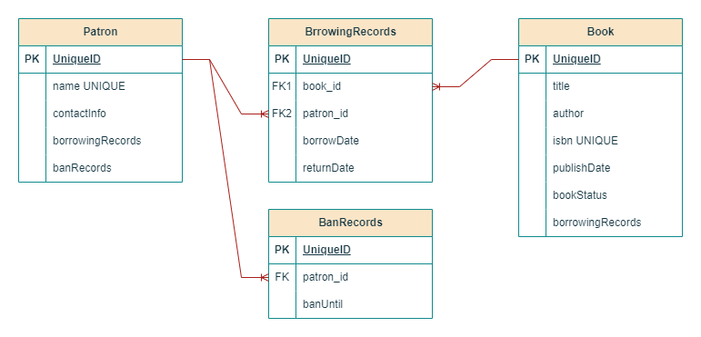

# Library Management System API

## Overview

This is a **Library Management System API** built using **Spring Boot**. The system allows librarians to manage books, patrons, and borrowing records efficiently.

## Features

- **Book Management**: Add, update, retrieve, and delete books.
- **Patron Management**: Manage patrons and their details.
- **Borrowing System**: Handle book borrowing and returns.
- **Authentication & Authorization**: Register, login, and refresh authentication tokens.
- **Auditing**: Keep track of entity creation and updates.
- **Business Logic**:
  - A patron can borrow books and return them.
  - If a patron does not return a book within the due date plus a 1-week grace period, they are banned for **6 months**.
  - A banned patron **cannot borrow books** unless they return overdue books or are unbanned.
- **Validation & Error Handling**: Ensures data integrity and user-friendly error responses.
- **Testing**: Unit tests for core services and repositories, along with some integration tests.

## Entity Relationships

- **Patron ↔ BorrowingRecord** *(One-to-Many)*: A patron can have multiple borrowings.
- **Book ↔ BorrowingRecord** *(One-to-Many)*: A book can be borrowed multiple times.
- **Patron ↔ BanRecord** *(One-to-Many)*: A patron can be banned multiple times.

## ERD



## API Endpoints

### Authentication

- `POST /api/auth/register` - Register a new user
- `POST /api/auth/login` - Authenticate and receive a token
- `POST /api/auth/refresh-token` - Refresh authentication token

### Book Management

- `GET /api/books` - Retrieve all books
- `GET /api/books/{id}` - Get book details by ID
- `POST /api/books` - Add a new book
- `PUT /api/books/{id}` - Update book details
- `DELETE /api/books/{id}` - Delete a book

### Patron Management

- `GET /api/patrons` - Retrieve all patrons
- `GET /api/patrons/{id}` - Get patron details by ID
- `POST /api/patrons` - Add a new patron
- `PUT /api/patrons/{id}` - Update patron details
- `DELETE /api/patrons/{id}` - Remove a patron

### Borrowing System

- `POST /api/borrow/{bookId}/patron/{patronId}` - Allow a patron to borrow a book
- `PUT /api/return/{bookId}/patron/{patronId}` - Record the return of a book

## Database

- Uses \*\*H2 \*\*for persistent storage.
- Relationships ensure referential integrity.

## Security

- JWT-based authentication to protect endpoints.

## Transaction Management

- Uses `@Transactional` to maintain data consistency in critical operations.

## Caching

- Uses caffeine  caching mechanisms for frequent queries.

## Logging & Monitoring

- Implemented **Aspect-Oriented Programming (AOP)** for logging method calls and exceptions.

## Testing

- **Unit Tests**: Cover core service and repository functionalities.
- **Integration Tests**: Validate API interactions and database integrity.

## Running the Application

### Prerequisites

- Java 17+
- H2 database
- Maven

### Steps

1. Clone the repository:
   ```sh
   git clone <https://github.com/GOWaz/LMS_test.git>
   cd LMS_test
   ```
2. Configure `application.properties` for database credentials.
3. Build and run the application:
   ```sh
   mvn spring-boot:run
   ```

## Evaluation Criteria

- **Functionality**: Ensures all CRUD operations work correctly.
- **Code Quality**: Readable, maintainable, and follows best practices.
- **Error Handling**: Robust validation and meaningful error responses.
- **Testing**: Effective coverage of services and repository layers.
- **Bonus Features**: Authentication, caching, AOP logging, and transaction management.

